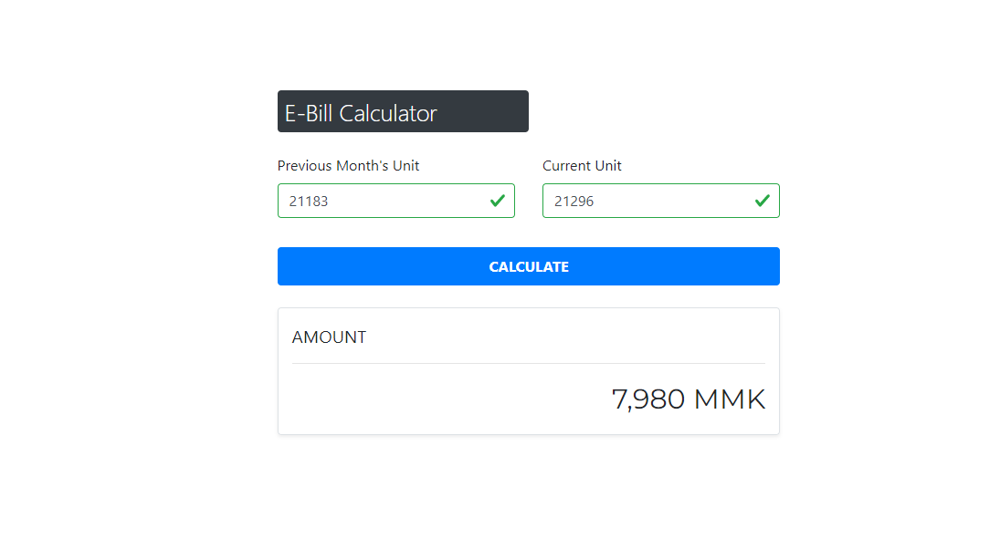

## Electricity Bill Calculator for Myanmar ⚡

 
- A simple elegant progressive web app for calculating the total amount of electricity consumed so far in MMK (Myanmar Kyat).
- Two types of inputs taken from the user where the first one is the previous month's electricity unit 📃 and the second one is the current units 📜.
- Check out the demo. 

## Technology Utilized 🛠

📌 HTML5 
📌 React-Bootstrap, Styled-components 
📌 ReactJS 
